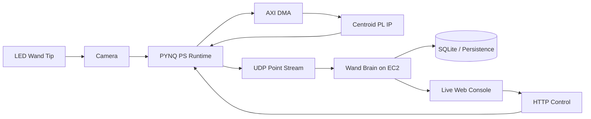

# FPGA-Wand

FPGA-Wand is a distributed drawing system: a bright LED wand is tracked by a
camera, reduced to centroid data on a PYNQ-Z1, streamed to a cloud service,
and turned into live drawings, scores, leaderboards, and node-control actions.

## Why This Project Is Interesting

This repository is best read as a compact embedded-systems portfolio piece. The
final system combines:

- FPGA + PS + cloud co-design in one working pipeline
- real-time point streaming over UDP
- bidirectional node control over HTTP
- multi-node operation against a shared backend
- live rendering, scoring, persistence, and leaderboards
- a browser-based control and observability console

## Start Here

If you are new to the repo, read these in order:

1. [docs/newcomer_guide.md](docs/newcomer_guide.md)
2. [docs/architecture/overview.md](docs/architecture/overview.md)
3. [FPGA/README.md](FPGA/README.md)
4. [software/README.md](software/README.md)

If you want a quick system explanation first, the project flow is:



## Repo Map

The repository is organized around the three main implementation areas plus a
shared documentation tree:

- [hardware/](hardware/)
  physical build information for the wand and camera setup
- [FPGA/](FPGA/)
  the adopted PYNQ runtime plus FPGA design artefacts
- [software/](software/)
  the cloud service, protocol definitions, and software-side tools
- [docs/](docs/)
  architecture, validation, runbooks, and archival project notes

For newcomers focused on the technical system, the most important paths are
`FPGA/`, `software/`, and `docs/architecture/`. The `docs/group/` subtree is
kept for archival project-management and report-preparation purposes, but it is not
required to understand the final runtime design.

## Choose A Path

| If you want to understand... | Open this first | Then go here |
| --- | --- | --- |
| The whole system in 10 minutes | [docs/newcomer_guide.md](docs/newcomer_guide.md) | [docs/architecture/overview.md](docs/architecture/overview.md) |
| The FPGA and PYNQ path | [FPGA/README.md](FPGA/README.md) | [FPGA/runtime/ps_pl_flow.md](FPGA/runtime/ps_pl_flow.md) |
| The UDP protocol and point flow | [software/protocol/README.md](software/protocol/README.md) | [software/protocol/protocol/pynq-udp-flow.md](software/protocol/protocol/pynq-udp-flow.md) |
| The Wand Brain backend | [software/cloud/README.md](software/cloud/README.md) | [software/cloud/report/backend_system_report.md](software/cloud/report/backend_system_report.md) |
| The frontend and live console | [software/cloud/frontend/README.md](software/cloud/frontend/README.md) | [software/cloud/frontend/index.html](software/cloud/frontend/index.html) |
| The database model and persistence | [software/cloud/database/README.md](software/cloud/database/README.md) | [software/cloud/database/models.py](software/cloud/database/models.py) |
| How to run the final system | [docs/demo/final_runbook.md](docs/demo/final_runbook.md) | [software/tools/README.md](software/tools/README.md) |
| Validation evidence | [docs/testing/system_validation_report.md](docs/testing/system_validation_report.md) | [software/tools/README.md](software/tools/README.md) |

## What The Final System Does

The final presented system follows this path:

1. A camera observes a bright LED wand tip.
2. The PYNQ PS preprocesses the frame into a binary image.
3. AXI DMA streams the image into a custom centroid IP in the PL.
4. The PS reads centroid statistics, filters them, and maintains stroke logic.
5. The PS sends accepted points to Wand Brain over UDP.
6. Wand Brain reconstructs attempts, renders images, scores them, stores
   finalized results, and serves the live dashboard.
7. The dashboard can also send HTTP control messages back to the PYNQ node.

The architecture deliberately separates:

- UDP as the low-latency point-stream data plane
- HTTP as the control and dashboard plane

## Engineering Highlights

- **Narrow, stable PL design**
  The adopted FPGA path uses a compact centroid-reduction IP rather than a
  heavier full-image pipeline, keeping the PL focused on deterministic
  acceleration.
- **Policy in the PS**
  The PYNQ PS handles filtering, stroke state, node control, and networking, so
  behaviour can be tuned without reworking the PL.
- **Stateful cloud runtime**
  Wand Brain reconstructs live attempts in memory, finalizes them into
  renderable images, scores them, and persists results only when appropriate.
- **Separation of planes**
  UDP is reserved for the point-stream path, while HTTP handles control,
  dashboard status, and operator-facing behaviour.
- **Operator-friendly system**
  The final web console supports monitoring, template selection, node control,
  recent attempts, stroke timing, and leaderboards from one page.

## Local Development

### Run the cloud app

```bash
cd software/cloud
bash start_script.sh --install-deps
```

Then open:

```text
http://127.0.0.1:8000/
```

### Run the PYNQ sender

The board-side demo is:

- [FPGA/runtime/pynq_wand_brain_demo.py](FPGA/runtime/pynq_wand_brain_demo.py)

The main demo can use the configured EC2 address or an overridden
`BRAIN_HOST` value. Each board also needs its own:

- `DEVICE_NUMBER`
- `WAND_ID`

For a more complete run path, see:

- [docs/demo/final_runbook.md](docs/demo/final_runbook.md)

## Source Of Truth

This repo contains both **canonical source** and **runtime-generated data**.
For newcomers, the key distinction is:

- edit and read the source under `hardware/`, `FPGA/`, `software/`, and `docs/`
- do not treat runtime-generated files as the authoritative implementation

Runtime-generated files are intentionally not the source of truth for GitHub:

- `software/cloud/data/fpgawand.sqlite3`
- `software/cloud/data/node_control_state.json`
- `software/cloud/data/outputs/*.png`
- EC2 deployment-only copies such as `cloud/alt_live_console`

The authoritative template source images live in:

- [software/cloud/backend/versions/brain_v2_scoring/data/templates](software/cloud/backend/versions/brain_v2_scoring/data/templates)

## Notes For Contributors

Commit the canonical source under `hardware/`, `FPGA/`, `software/`, and
`docs/`. Avoid committing runtime-only data copied back from local runs or EC2.
