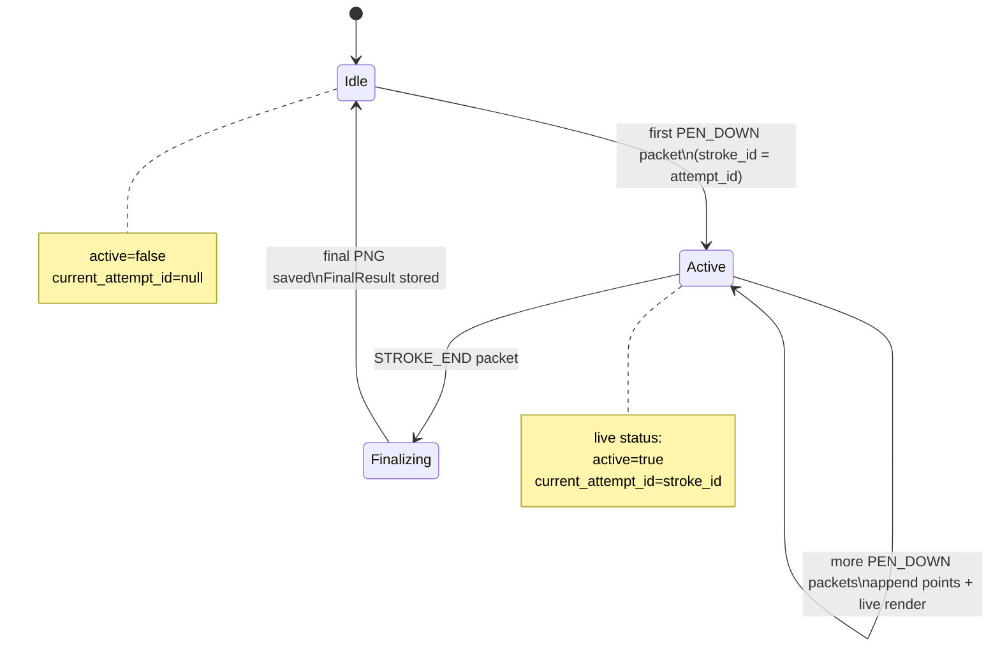
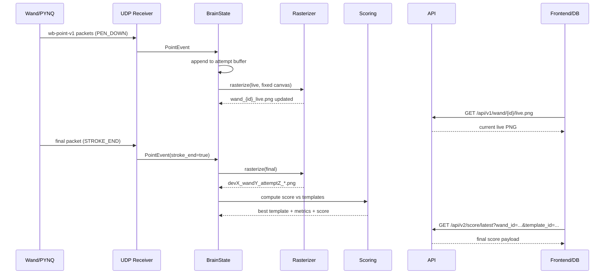

# Wand-Brain V2 Integration Guide (Detailed)

Status: Integration handbook for `cloud/backend/versions/brain_v2_scoring`

Audience:
- PYNQ UDP transmitter owner
- Backend database owner
- Backend web-server/frontend owner
- Wand-Brain operator (EC2)

This document explains exactly how to use Wand-Brain V2 end-to-end, with concrete contracts and diagrams.

---

## 0. What Wand-Brain V2 Does

Wand-Brain V2 is the runtime service that:
1. Receives UDP packets from PYNQ (`wb-point-v1`, 24 bytes).
2. Parses packets into normalized points.
3. Buffers one drawing attempt (button-hold) per `(device_number, wand_id, stroke_id)`.
4. Produces a live PNG while drawing is active (`/api/v1/wand/{wand_id}/live.png`).
5. Finalizes the attempt when `STROKE_END` arrives and writes final PNG.
6. Scores final drawing against reference templates (`data/templates/*.png`).
7. Exposes read-only HTTP APIs for UI and data ingestion.

Important model:
- One attempt = one full press-hold-release.
- `stroke_id` in UDP is the attempt id.

---

## 1. Runtime Paths, Ports, and Files

Base folder:
- `cloud/backend/versions/brain_v2_scoring`

Ports:
- UDP input: `41000` (hardcoded in server)
- HTTP API: `8000` (default from startup script)

Data folders:
- Templates: `data/templates/*.png`
- Output images: `data/outputs/*.png`

Main code files:
- API and state machine: `src/brain/api/server.py`
- UDP parser: `src/brain/ingest/parser.py`
- UDP socket receiver: `src/brain/ingest/udp_rx.py`
- Rasterizer: `src/brain/render/rasterize.py`
- Scoring engine: `src/brain/scoring/similarity.py`

Operational scripts:
- Start v2 service: `tools/start_brain_v2_server.sh`
- Generate templates: `tools/generate_templates.py`
- Overlay live demo: `tools/run_observable_v2_overlay_demo.sh`

TX simulation scripts (repo root `tools/`):
- Long noisy stroke: `tools/wb_tx_long_noisy_stroke.py`
- Rate sweep sender: `tools/wb_tx_rate_test.py`

---

## 2. System Architecture (Detailed)

```mermaid
flowchart LR
  subgraph Sensing[Wand + PYNQ Side]
    ESP[ESP32 Button/IR Events]
    CAM[IR Camera Tracking]
    PYNQ[PYNQ UDP TX\nwb-point-v1 packer]
    ESP --> PYNQ
    CAM --> PYNQ
  end

  PYNQ -- UDP 24-byte packets :41000 --> RX[UdpReceiver\nthreaded socket]
  RX --> PARSE[parse_packet\nmagic/version/range checks]
  PARSE --> STATE[BrainState\nattempt buffers]

  STATE --> LIVE[Live renderer\nwand_{id}_live.png]
  STATE --> FINAL[Finalize on STROKE_END\ndevX_wandY_attemptZ_*.png]

  FINAL --> SCORE[Scoring Engine\nDice + IoU + area_ratio]
  SCORE --> RES[FinalResult fields\nscore/template metadata]

  subgraph API[FastAPI Endpoints]
    H1[/api/v1/* live and image APIs]
    H2[/api/v2/* templates and scoring APIs]
  end

  STATE --> H1
  RES --> H1
  SCORE --> H2

  H1 --> WEB[Web server/frontend polling]
  H1 --> DB[Database ingester]
  H2 --> WEB
  H2 --> DB
```

### 2.1 Attempt State Machine



### 2.2 Sequence (End-to-End)



---

## 3. UDP Protocol Contract (For PYNQ Owner)

### 3.1 Packet Structure

`wb-point-v1` fixed 24-byte little-endian packet:

Struct format:
- `"<HBBHHIIhhI"`

Field order:
1. `uint16 magic` (`0x5742`)
2. `uint8 version` (`1`)
3. `uint8 flags`
4. `uint16 device_number`
5. `uint16 wand_id`
6. `uint32 packet_number`
7. `uint32 stroke_id` (attempt id)
8. `int16 x_q` (0..32767)
9. `int16 y_q` (0..32767)
10. `uint32 timestamp_ms`

### 3.2 Flags

- `PEN_DOWN = 0x01`
- `STROKE_START = 0x02`
- `STROKE_END = 0x04`

Expected semantics:
- During active hold: send points with `PEN_DOWN=1`.
- First valid point of attempt: also set `STROKE_START=1`.
- End of attempt: send one final packet with `STROKE_END=1` and `PEN_DOWN=0`.

### 3.3 Validation Rules in Brain

Packet is discarded if:
- length is not 24
- magic mismatch
- version mismatch
- `x_q` or `y_q` outside `0..32767`

### 3.4 Required PYNQ Behavior Checklist

- Keep `device_number` stable per board.
- Keep `wand_id` stable per wand.
- Increment `packet_number` monotonically.
- Use one `stroke_id` for one full press-hold-release.
- Always emit an end marker if points were emitted.

### 3.5 PYNQ Python Example (Authoritative Packing)

```python
import socket, struct, time
WB = struct.Struct("<HBBHHIIhhI")
MAGIC = 0x5742
VERSION = 1
PEN_DOWN, STROKE_START, STROKE_END = 0x01, 0x02, 0x04

def q15(v):
    return max(0, min(32767, int(round(v * 32767))))

sock = socket.socket(socket.AF_INET, socket.SOCK_DGRAM)
addr = ("<brain-host>", 41000)

device, wand, stroke_id = 1, 1, 12345
pkt = 0

# Active points
for i in range(100):
    x = i / 99
    y = i / 99
    flags = PEN_DOWN | (STROKE_START if i == 0 else 0)
    payload = WB.pack(MAGIC, VERSION, flags, device, wand, pkt, stroke_id, q15(x), q15(y), int(time.time()*1000)&0xFFFFFFFF)
    sock.sendto(payload, addr)
    pkt += 1

# Final packet
payload = WB.pack(MAGIC, VERSION, STROKE_END, device, wand, pkt, stroke_id, q15(x), q15(y), int(time.time()*1000)&0xFFFFFFFF)
sock.sendto(payload, addr)
```

---

## 4. API Contract (For Web-Server + DB Owners)

All APIs are read-only (`GET`, image endpoints also accept `HEAD`).

### 4.1 Health and Wand Status

#### `GET /api/v1/health`
Use: service liveness and deployment check.

Response example:
```json
{
  "ok": true,
  "service": "wand-brain",
  "version": "0.1.0",
  "time_ms": 1772200000000
}
```

#### `GET /api/v1/wands`
Use: list all known wands and current active state.

Response example:
```json
{
  "time_ms": 1772200000000,
  "wands": [
    {
      "wand_id": 1,
      "active": false,
      "current_attempt_id": null,
      "last_point_ms": 2677000000
    }
  ]
}
```

#### `GET /api/v1/wand/{wand_id}`
Use: single wand status (`404` if unknown).

---

### 4.2 Live and Final Rendering

#### `GET/HEAD /api/v1/wand/{wand_id}/live.png`
Use: polling live drawing image.
- Returns current live PNG during active attempt.
- Falls back to latest finalized image for that wand.
- Returns `404` if no image exists yet.

#### `GET/HEAD /api/v1/attempt/{attempt_id}/image.png`
Use: final attempt image lookup by attempt id.

#### `GET /api/v1/attempt/latest?wand_id=<int>`
Use: latest finalized attempt metadata for one wand.

Response example:
```json
{
  "attempt_id": 931100,
  "wand_id": 1,
  "device_number": 1,
  "start_ms": 2677342155,
  "end_ms": 2677362927,
  "num_points": 300,
  "result": {
    "status": "processed",
    "best_template_id": "heart_v1",
    "best_template_name": "Heart V1",
    "score": 23.35
  },
  "image_png": "/api/v1/attempt/931100/image.png"
}
```

---

### 4.3 Scoring and Templates

#### `GET /api/v2/templates`
Use: discover available scoring references.

Example:
```json
{
  "count": 5,
  "templates": [
    {"template_id": "circle_v1", "name": "Circle V1", "image_png": "/api/v2/template/circle_v1/image.png"},
    {"template_id": "heart_v1", "name": "Heart V1", "image_png": "/api/v2/template/heart_v1/image.png"}
  ]
}
```

#### `GET/HEAD /api/v2/template/{template_id}/image.png`
Use: fetch template image for UI overlay.

#### `GET /api/v2/score/latest?wand_id=<id>&template_id=<optional>`
Use: score latest attempt for one wand.
- if `template_id` is provided: score only that template.
- if omitted: evaluates all templates and returns best.

#### `GET /api/v2/score/attempt/{attempt_id}?template_id=<optional>`
Use: score a specific attempt id.

Score response example:
```json
{
  "attempt_id": 931100,
  "wand_id": 1,
  "device_number": 1,
  "num_points": 300,
  "best": {
    "template_id": "heart_v1",
    "template_name": "Heart V1",
    "score": 23.35,
    "metrics": {
      "dice": 0.2486,
      "iou": 0.1419,
      "area_ratio": 0.471,
      "draw_pixels_on": 1986,
      "template_pixels_on": 4217,
      "intersection_pixels": 771,
      "union_pixels": 5432
    }
  },
  "all_candidates": [...],
  "attempt_image_png": "/api/v1/attempt/931100/image.png"
}
```

---

## 5. Scoring Logic (For DB and ML/Algo Discussion)

Current scoring in `similarity.py`:
1. Convert drawing and template PNG to binary masks (`threshold=10`).
2. Compute:
- `intersection_pixels`
- `union_pixels`
- `draw_pixels_on`
- `template_pixels_on`
3. Derived metrics:
- `iou = intersection / union`
- `dice = 2*intersection / (draw_on + template_on)`
- `area_ratio = min(draw_on, template_on) / max(draw_on, template_on)`
4. Composite final score:
- `score = 100 * (0.55*dice + 0.35*iou + 0.10*area_ratio)`

Interpretation guidance (practical):
- `>= 70`: very close
- `40..70`: partially matching
- `< 40`: weak match

Note: thresholds should be calibrated with your real hardware traces.

---

## 6. Web-Server Team Integration Guide (Step-by-Step)

### 6.1 Minimum Polling Strategy

Every 200 ms:
- `GET /api/v1/wand/{wand_id}/live.png` (cache-busted query string)

Every 700 ms:
- `GET /api/v1/wand/{wand_id}`
- If `active == false`: call score endpoint

On stroke finish:
- `GET /api/v2/score/latest?wand_id=<id>&template_id=<selected_template>`
- Display `best.score`

### 6.2 Overlay UI Strategy

- background layer: `/api/v2/template/{template_id}/image.png` with opacity ~0.45-0.55
- drawing layer: `/api/v1/wand/{wand_id}/live.png` with `mix-blend-mode: screen` and opacity ~0.85-1.0

This preserves template visibility while drawing progresses.

### 6.3 Browser Caching Notes

Image endpoints include anti-cache headers. Still add cache-bust query:
- `...?t=<Date.now()>`

### 6.4 CORS

V2 server includes permissive CORS middleware. If frontend still cannot fetch JSON:
- verify `Access-Control-Allow-Origin` header on `/api/v2/score/latest` response.

---

## 7. Database Team Integration Guide (Step-by-Step)

Wand-Brain currently does not write directly to DB. Recommended ingestion pattern is pull-based.

### 7.1 Poll and Persist Plan

Per wand:
1. Poll `/api/v1/attempt/latest?wand_id=<id>` every 500-1000 ms.
2. If `attempt_id` changed, fetch:
- final image from `/api/v1/attempt/{attempt_id}/image.png`
- score from `/api/v2/score/attempt/{attempt_id}`
3. Persist one immutable attempt record.

### 7.2 Recommended Primary Key

Use composite key in DB:
- `(device_number, wand_id, attempt_id)`

Reason:
- `attempt_id` alone may collide across devices/wands if transmitters reuse stroke ids.

### 7.3 Suggested SQL Schema

```sql
create table wand_attempts (
  device_number      integer not null,
  wand_id            integer not null,
  attempt_id         bigint not null,
  start_ms           bigint not null,
  end_ms             bigint not null,
  finalized_at_ms    bigint,
  num_points         integer not null,
  status             text not null,
  best_template_id   text,
  best_template_name text,
  score              double precision,
  image_url          text,
  raw_score_json     jsonb,
  created_at         timestamptz default now(),
  primary key (device_number, wand_id, attempt_id)
);
```

### 7.4 Suggested Ingestion Pseudocode

```python
last_seen = {}  # key: wand_id -> attempt_id

for wand_id in active_wands:
    latest = GET(f"/api/v1/attempt/latest?wand_id={wand_id}")
    aid = latest["attempt_id"]
    if last_seen.get(wand_id) == aid:
        continue

    score = GET(f"/api/v2/score/attempt/{aid}")
    image_bytes = GET_BYTES(latest["image_png"])

    upsert_attempt(
      device_number=latest["device_number"],
      wand_id=latest["wand_id"],
      attempt_id=aid,
      start_ms=latest["start_ms"],
      end_ms=latest["end_ms"],
      num_points=latest["num_points"],
      status=latest["result"]["status"],
      best_template_id=score["best"]["template_id"],
      score=score["best"]["score"],
      raw_score_json=score,
    )

    last_seen[wand_id] = aid
```

---

## 8. EC2 Operations (Dumb-Proof Runbook)

### 8.1 First-Time Start

```bash
cd ~/fpga_wand/Information-Processing_Group_10_fpga_wand
cloud/backend/versions/brain_v2_scoring/tools/start_brain_v2_server.sh \
  --host 0.0.0.0 \
  --port 8000 \
  --install-deps \
  --generate-templates
```

### 8.2 Restart After Code Update

```bash
pkill -f "uvicorn brain.api.server:app" || true
cd ~/fpga_wand/Information-Processing_Group_10_fpga_wand
cloud/backend/versions/brain_v2_scoring/tools/start_brain_v2_server.sh \
  --host 0.0.0.0 \
  --port 8000 \
  --generate-templates
```

### 8.3 Health Verification

```bash
curl -s http://<EC2_IP>:8000/api/v1/health
curl -s http://<EC2_IP>:8000/api/v2/templates
```

---

## 9. End-to-End Test Recipes

### 9.1 Long Heart Stroke With Noise

```bash
python3 tools/wb_tx_long_noisy_stroke.py \
  --host <EC2_IP> --port 41000 \
  --device 1 --wand 1 --stroke-id 931100 \
  --shape heart --rate 15 --duration 20 \
  --noise-std 0.006 --wander-std 0.002 --seed 7
```

### 9.2 Overlay + Live + Score Demo (One Command)

```bash
cloud/backend/versions/brain_v2_scoring/tools/run_observable_v2_overlay_demo.sh \
  --api-host <EC2_IP> --udp-host <EC2_IP> \
  --template heart_v1 --shape heart \
  --duration 20 --rate 15 --stroke-id 931100
```

### 9.3 Post-Test API Checks

```bash
curl -s "http://<EC2_IP>:8000/api/v1/attempt/latest?wand_id=1"
curl -s "http://<EC2_IP>:8000/api/v2/score/latest?wand_id=1&template_id=heart_v1"
```

---

## 10. Known Constraints and Integration Notes

1. UDP reliability:
- UDP is lossy. Wand-Brain does not retransmit.
- Packet drops reduce point density and can lower score.

2. Attempt identity:
- Internal buffering uses `(device, wand, stroke_id)`.
- Some API lookup paths still use `attempt_id` directly; keep stroke ids unique enough in practice.

3. Fixed canvas mode:
- Live/final rendering uses fixed coordinate mapping (stable viewport).
- Ensure PYNQ sends normalized coordinates expected in `[0,1]` before Q15 encoding.

4. Template format:
- Scoring expects PNG templates in `data/templates`.
- White stroke on black background gives best behavior.

5. Score semantics:
- Current score is heuristic overlap score, not ML confidence.

---

## 11. API Error Matrix

Common errors and meaning:

- `404 wand not found`:
  - `/api/v1/wand/{id}` before first packet for that wand.

- `404 no attempt yet for this wand`:
  - scoring/latest attempt queried before any finalized stroke.

- `404 template not found`:
  - requested template id missing from `data/templates`.

- `400 no templates found in data/templates`:
  - forgot to run `tools/generate_templates.py` or deploy templates.

- Browser shows drawing but no score:
  - usually CORS mismatch or old backend instance without `/api/v2/*`.

---

## 12. Role-Specific Checklists

### PYNQ Owner Checklist

- [ ] UDP packets are 24-byte `wb-point-v1`.
- [ ] `magic=0x5742`, `version=1`.
- [ ] `x_q,y_q` in `0..32767`.
- [ ] `PEN_DOWN` on active points.
- [ ] `STROKE_END` sent exactly once at release.
- [ ] `stroke_id` maintained through full hold.

### Web-Server Owner Checklist

- [ ] Use `/api/v2/templates` for template picker.
- [ ] Render template background via `/api/v2/template/{id}/image.png`.
- [ ] Render live draw via `/api/v1/wand/{id}/live.png`.
- [ ] On end, fetch `/api/v2/score/latest?wand_id=...&template_id=...`.
- [ ] Display `final score`.

### Database Owner Checklist

- [ ] Poll `/api/v1/attempt/latest` per wand.
- [ ] On attempt change, persist metadata + score JSON + image.
- [ ] Use composite PK `(device_number, wand_id, attempt_id)`.
- [ ] Keep immutable per-attempt records.

### Wand-Brain Operator Checklist

- [ ] Start correct version (`brain_v2_scoring`, not MVP folder).
- [ ] Run with `--generate-templates`.
- [ ] Confirm `/api/v2/templates` returns expected set.
- [ ] Confirm security group allows UDP 41000 and TCP 8000.

---

## 13. Quick Self-Diagnostic Commands

```bash
# Is v2 actually running?
curl -s http://<EC2_IP>:8000/api/v2/templates

# Is heart template present?
curl -I http://<EC2_IP>:8000/api/v2/template/heart_v1/image.png

# Is live image updating?
curl -I "http://<EC2_IP>:8000/api/v1/wand/1/live.png?t=$(date +%s%N)"

# Is score available?
curl -s "http://<EC2_IP>:8000/api/v2/score/latest?wand_id=1&template_id=heart_v1"
```

---

## 14. Diagram: Full Functional Breakdown

```mermaid
flowchart TB
  A[UDP Packet Ingress]\nwb-point-v1:41000 --> B[Packet Parser]
  B -->|valid| C[PointEvent]
  B -->|invalid| BX[Drop packet]

  C --> D{flags}
  D -->|PEN_DOWN=1| E[Append to attempt buffer]
  D -->|STROKE_END=1| F[Finalize attempt]

  E --> G[Live rasterization]\nfixed canvas mapping
  G --> H[/api/v1/wand/{id}/live.png]

  F --> I[Final rasterization]\nfinal PNG in data/outputs
  I --> J[FinalResult store]
  J --> K[/api/v1/attempt/latest]
  J --> L[/api/v1/attempt/{id}/image.png]

  J --> M[Score against templates]
  M --> N[/api/v2/score/latest]
  M --> O[/api/v2/score/attempt/{id}]

  P[data/templates/*.png] --> M
  P --> Q[/api/v2/templates]
  P --> R[/api/v2/template/{id}/image.png]

  H --> UI[Frontend overlay canvas]
  R --> UI
  N --> UI

  K --> DB[DB ingester]
  O --> DB
  L --> DB
```

---

## 15. Final Notes

This guide is written to be operationally explicit and role-separable.
If all three role owners follow their checklist, integration should be deterministic and reproducible.

